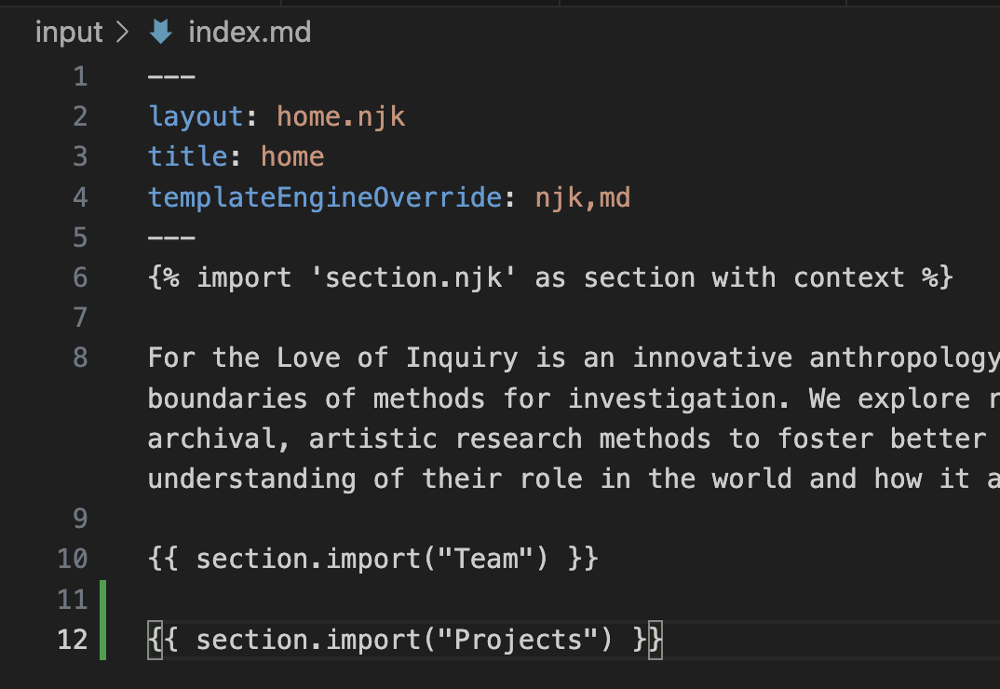
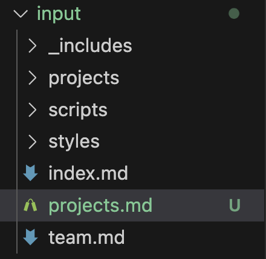
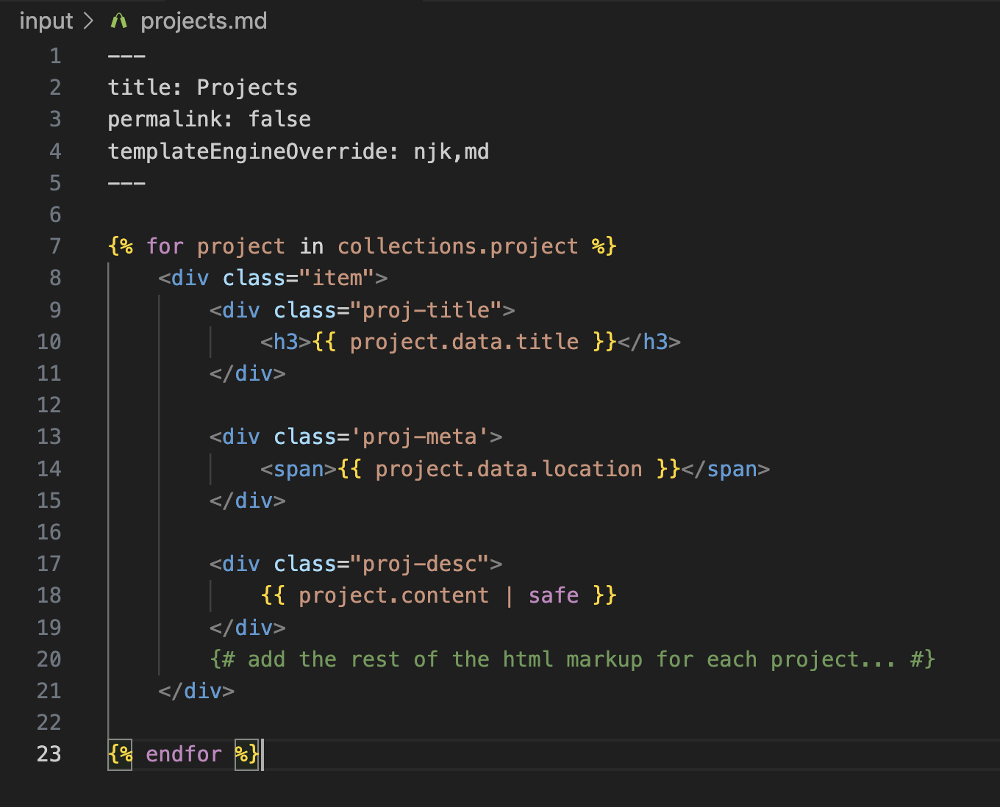
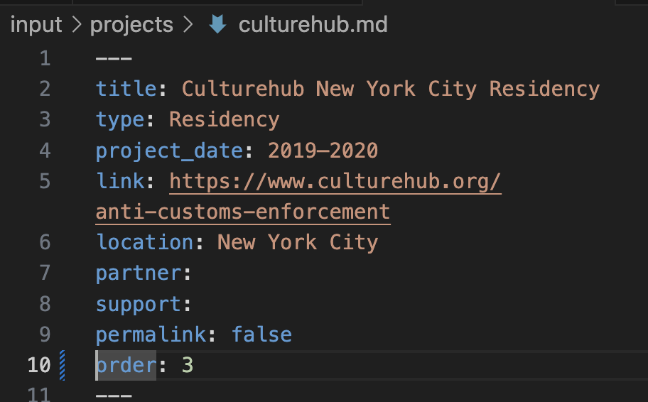

We can start by adding an import for a section called "projects" in `index.md`:

Obviously no file corresponds to this yet. We're going to create one, in the root folder of `input` (the same level as `team.md` and `index.md`)

But the content of projects is different from `team.md` or any generic section, because it's supposed to generate a list of all the projects with custom HTML markup and styling. I considered it, and I think the easiest way to accomplish this will be to write nunjucks directly into the `projects.md` file. See below:

To break down what is happening here:

1. Just like in all the other markdown files except `index`, we set `permalink` to `false` so it doesn't generate a separate page. Additionally, we set `templateEngineOverride` to accept nunjucks (njk), so we can write nunjucks directly into this file.

2. `collections.project` is [eleventy's built-in method](https://www.11ty.dev/docs/collections/#a-blog-example) of accessing all posts with the tag "project". It gives us an array of JS objects representing each project.

3. ` ... ` is [Nunjucks syntax](https://mozilla.github.io/nunjucks/templating.html#for) for a _for_ loop. It loops through every project in the array, and generates whatever HTML you want it to, while inserting data for each project in the loop. You can see I added the project title, location, and rendered markdown content as an example. 

A few notes:

* By doing the project templating directly in `projects.md`, we don't need to change anything about `_includes/section.njk`. We can also actually delete `_includes/project.njk`, because it never gets used for anything.

* In the demo above, projects are sorted according to Eleventy's default sorting method (which I believe is file creation date). I would start by just getting this working. But in the future we can set it to sort by project date, or allow the team to set a custom order using a number field in the front matter of each project:

* I realize I never really explained fully how `section.njk` works. This file defines a nunjucks `macro` ([documented here](https://mozilla.github.io/nunjucks/templating.html#macro)) called "import". As the docs say, macros are sort of analogous to functions in JS. They take input parameters (in this case, the page name), and output templatized HTML using that information.
